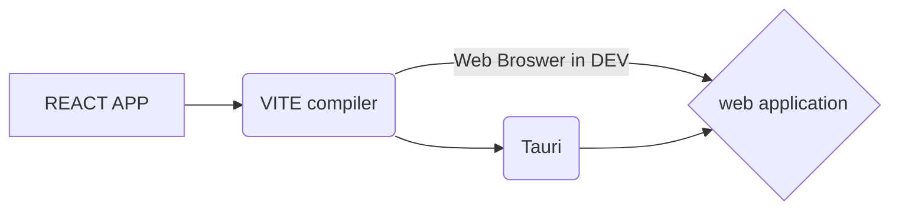

# Tauri & React  Template

Hi! here some files to start a new **Tauri app**. If you want to learn about wtf is Tauri go to  [Tauri docs](https://tauri.studio/docs/getting-started/prerequisites) , or you can read  [Tauri RUST docs](https://docs.rs/tauri/latest/tauri/) .

# How to start

    git clone https://github.com/dnettoRaw/tauri

    npm i

>  edit the names etc and add somme stuffs 

    npm t:dev

> deploy your amazing application

## Tree files and folders
```
├── README.md
├── index.html
├── package.json
├── src
│ 	├── assets
│ 	│ 	├── favicon.svg
│ 	│ 	└── logo.svg
│ 	├── css
│ 	│ 	├── App.css
│ 	│ 	└── index.css
│ 	├── modules
│ 	├── pages
│ 	│ 	├── App.tsx
│ 	│ 	└── main.tsx
│ 	└── vite-env.d.ts
├── src-tauri
│ 	├── Cargo.toml
│ 	├── icons
│ 	│ 	└──[icons  files]
│ 	├── src
│ 	│ 	├── build.rs
│ 	│ 	├── main.rs
│ 	│ 	└── custon-function
│ 	│ 		└──[functions].rs
│ 	└── tauri.conf.json
├── test
│ 	└── [your  test  files].tsx
├── tsconfig.json
├── tsconfig.node.json
└── vite.config.ts
```

# todo
- [x] npm commands in readme 
- [ ] yarn commands in readme
- [ ] auto change log
- [x] auto update version package 
- [ ] lint
- [ ] test files 

## Commands
| npm              |                    Description                    |
|------------------|---------------------------------------------------|
|`npm start`       |  start your app in dev
|`npm run dev`     |  start dev with hot refresh
|`npm run build`   |  build your project, for stactic render, this command auto update patch verion in packege
|`npm run preview` |  start `vite preview` for server your pre-build app (only host compiled)      
|`npm run t`       |  to run tauri commands from main folder
|`npm run t:dev`   |  shortcut for tauri dev
|`npm run t:build` |  shortcut for tauri build
|`npm run publish` |  create a stable version of the app, ~~and copies it to the main folder~~ 
|                  |  (update package minor version) &(~~olds files is deleted by default~~)

| bonus section    |                             |
|------------------|-----------------------------|
|`npm run v:minor` |  update package minor version `0.1.0`
|`npm run v:major` |  update package major version `1.0.0`
|`npm run clean`   |  This command `deletes` all autogeneration files.
|`npm run test`    |  run test in your test folder (empty by default )


## Little flow cart



## bug

if your want to use tauri app in dev and you get a blank screen please change `"devPath": "http://127.0.0.1:3000"` to `"devPath": "http://localhost:3000"` but you need to change that again every time wen you want to make a new build. ([bug found here](https://github.com/tauri-apps/tauri/issues/1140#issuecomment-848874865))

## little tips

to optmize you binary you can try to change `opt-level` value to `z` or `s` in `/src-tauri/cargo.toml` this can reduce the final size of you binary 

## Some links

[official tauri discord](https://discord.gg/tauri)

[tauri studio](https://tauri.studio)

[tauri github](https://github.com/tauri-apps)

[tauri rust doc](https://docs.rs/tauri/1.0.0-rc.3/tauri/index.html)
